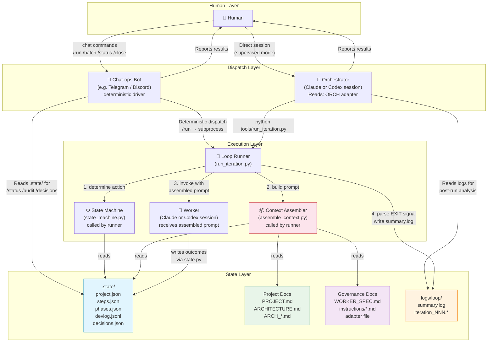
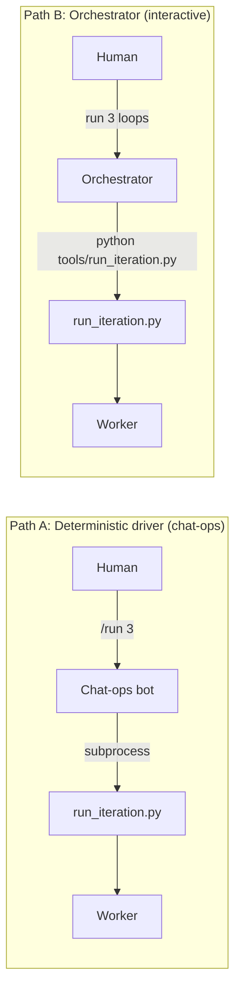
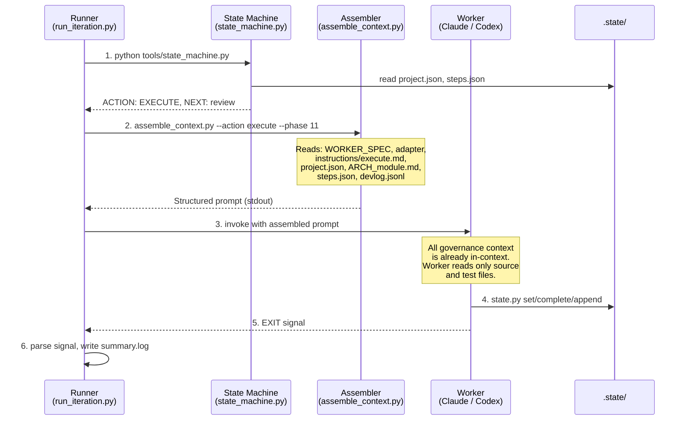
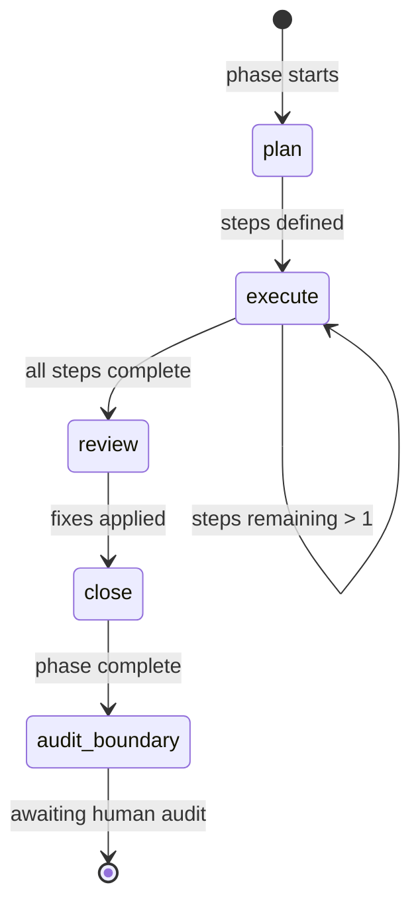
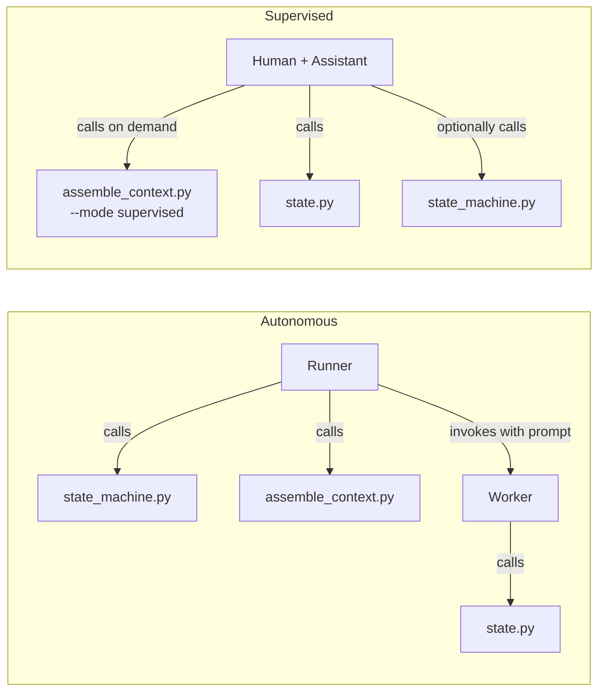

# i2c Workflow Map

## Actor Topology



## Two Dispatch Paths

There are **two independent ways** to dispatch worker iterations:



**Path A (deterministic driver):** A chat-ops bot (e.g. a Telegram or Discord bot) receives a command, directly shells out to `run_iteration.py`, reads results from files, and formats a report. No LLM judgment in the dispatch path — the bot is a plain program, not an AI session. It also handles `/status`, `/audit`, `/close` by reading `.state/` directly.

**Path B (Orchestrator):** AI-mediated. An orchestrator session (Claude or Codex) receives freeform instructions, decides what to do, shells out to `run_iteration.py`, then reads logs and reports back. The orchestrator makes judgment calls: "should I dispatch another iter?", "is this error worth escalating?", "what do I tell the human?"

**Key insight:** Both paths use the same runner, same worker, same state files. The difference is who sits between the human and the runner: a deterministic program or an AI session.

---

## Invocation Flow

The runner assembles context *before* the worker starts, so the worker reads zero governance files.



### Single-step vs multi-step

**Single-step (STEP_BUDGET = 1, common case):** Runner handles everything before invocation. Worker does one action and exits.

**Multi-step (STEP_BUDGET > 1):** First step's context arrives pre-assembled. Between steps, the worker calls the assembler for updated context:

```bash
# Mid-step context request:
python3 tools/assemble_context.py --action execute --phase 11

# Or request a single section:
python3 tools/assemble_context.py --section architecture
python3 tools/assemble_context.py --section module --module event_store
```

---

## Phase Lifecycle — Step by Step



| State | Assembled into prompt | Worker reads directly | Worker writes |
|-------|----------------------|----------------------|---------------|
| **plan** | instructions/plan.md, PROJECT.md, ARCHITECTURE.md, ARCH_module.md | — | steps.json, project.json, devlog.jsonl |
| **execute** | instructions/execute.md, ARCH_module.md, steps.json, recent devlog | source files, test files | steps.json, devlog.jsonl, project.json |
| **review** | instructions/review.md, ARCH_module.md, ARCHITECTURE.md, phase devlog, decisions | source files | devlog.jsonl, project.json |
| **close** | instructions/close.md, ARCH_module.md, phase devlog, decisions | source/test files | phases.json, project.json (gotchas; state→audit_boundary) |

**Always assembled** (every action): WORKER_SPEC (identity, loop, escalation, output contract, prohibitions), adapter (tool rules, project notes), project.json (state, gotchas), module list.

After CLOSE the worker leaves the project in `audit_boundary`; the human (or an autonomous wrapper) clears the gate — see below.

---

## Detailed Action Map

### What happens BEFORE the worker starts

```
Dispatch request (human → driver/orchestrator → runner)
  │
  ├─ Runner calls: python tools/state_machine.py
  │   ├─ Reads: .state/project.json, .state/steps.json
  │   ├─ Checks: halt state (audit_boundary / audit_escalation / done)? budget exhausted?
  │   ├─ Computes: ACTION + NEXT
  │   └─ If EXIT → runner stops, no worker invocation
  │
  ├─ Runner calls: python3 tools/assemble_context.py --action $ACTION --phase $PHASE
  │   ├─ Reads: WORKER_SPEC.md (identity, loop, escalation, output, prohibitions)
  │   ├─ Reads: adapter file (tool rules, project notes, module list)
  │   ├─ Reads: instructions/$ACTION.md (action procedure)
  │   ├─ Reads: .state/project.json (state, gotchas)
  │   ├─ Reads: PROJECT.md (if PLAN action)
  │   ├─ Reads: ARCHITECTURE.md (if PLAN or REVIEW action)
  │   ├─ Reads: ARCH_module.md (all actions)
  │   ├─ Reads: .state/steps.json, devlog.jsonl, decisions.json (per action)
  │   └─ Outputs: structured prompt with section delimiters
  │
  └─ Runner invokes worker with assembled prompt
      └─ Worker has zero governance files to read — starts working immediately
```

### PLAN action

| Step | What happens | Worker reads | Worker writes |
|------|-------------|-------------|---------------|
| 1 | Determine scope | (in prompt: PROJECT.md, ARCHITECTURE.md) | — |
| 2 | Identify work regime | (in prompt: instructions/plan.md) | — |
| 3 | Break into steps | (in prompt: ARCH_module.md) | — |
| 4 | **If non-leaf module:** dependency probe | source files for dep verification | devlog.jsonl (probe result) |
| 5 | Write step breakdown | — | steps.json (new step records) |
| 6 | Transition state | — | project.json (state→execute) |
| 7 | Commit + devlog | — | devlog.jsonl, git commit |

### EXECUTE action (repeats per step)

| Step | What happens | Worker reads | Worker writes |
|------|-------------|-------------|---------------|
| 1 | Pick next pending step | (in prompt: steps.json) | — |
| 2 | Read context | source files, test files | — |
| 3 | Implement | source files, test files | source files, test files |
| 4 | Run tests | — | — |
| 5 | Mark step complete | — | steps.json (step→complete) |
| 6 | Log what happened | — | devlog.jsonl (append entry) |
| 7 | Commit | — | git commit |
| 8 | Transition state | — | project.json (state→review if last step) |

### REVIEW action

| Step | What happens | Worker reads | Worker writes |
|------|-------------|-------------|---------------|
| 1 | Identify phase scope | (in prompt: steps.json) | — |
| 2 | Read all phase code | source files | — |
| 3 | Check: dead code, arch drift, simplification | (in prompt: ARCHITECTURE.md) | — |
| 4 | Categorize findings | — | — |
| 5 | Apply must-fix + should-fix | source files | source files |
| 6 | Log review findings | — | devlog.jsonl (review entry) |
| 7 | Commit fixes | — | git commit |
| 8 | Transition state | — | project.json (state→close) |

### CLOSE action

| Step | What happens | Worker reads | Worker writes |
|------|-------------|-------------|---------------|
| 1 | Run phase-level tests | source/test files | — |
| 2 | **If non-leaf module:** integration check | consumer source/test files | devlog.jsonl |
| 3 | Devlog learning review | (in prompt: devlog.jsonl) | project.json (gotchas[]) |
| 4 | Contract scan + propagation | (in prompt: devlog.jsonl) | ARCH_*.md (if needed) |
| 5 | Update phase status | — | phases.json (phase→complete) |
| 6 | Set the human gate | — | project.json (state→audit_boundary) |
| 7 | Commit | — | git commit |
| 8 | Exit | — | EXIT signal |

### After CLOSE — human gate

| Step | Who | What happens | Reads | Writes |
|------|-----|-------------|-------|--------|
| 1 | Driver/Orch | Report phase complete | .state/, logs/ | chat message |
| 2 | Human | Audit: review commits, decisions, contracts | git log, decisions.json | — |
| 3 | Human | `/close` command | — | — |
| 4 | Driver/Orch | Advance to next phase | — | project.json (phase=N+1, state=plan) |
| 5 | Driver/Orch | Append audit record | — | audits.log |
| 6 | Human | `/run N` — next phase begins | — | — |

To end the project instead of advancing, the human declares it terminal:
`state.py set project.json state=done`.

---

## Supervised Mode

In supervised mode, a human works directly with an AI assistant. The same tools serve both modes:



Common supervised commands:

| Task | Command |
|------|---------|
| Cold-start orientation | `assemble_context.py --section status` |
| Plan a phase | `assemble_context.py --action plan --mode supervised` |
| Mark a step done | `state.py complete` + `state.py append devlog.jsonl` |
| Review a phase | `assemble_context.py --action review --mode supervised` |
| Close a phase | `assemble_context.py --action close --mode supervised` |
