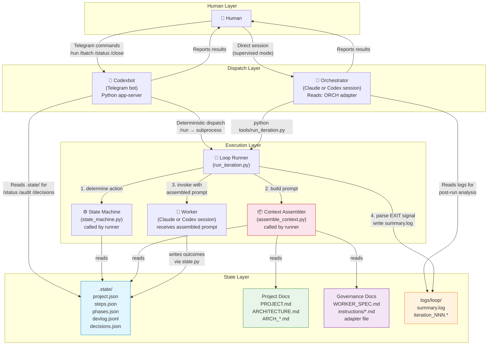
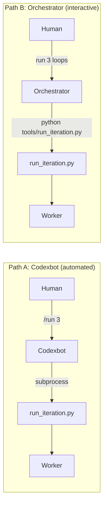
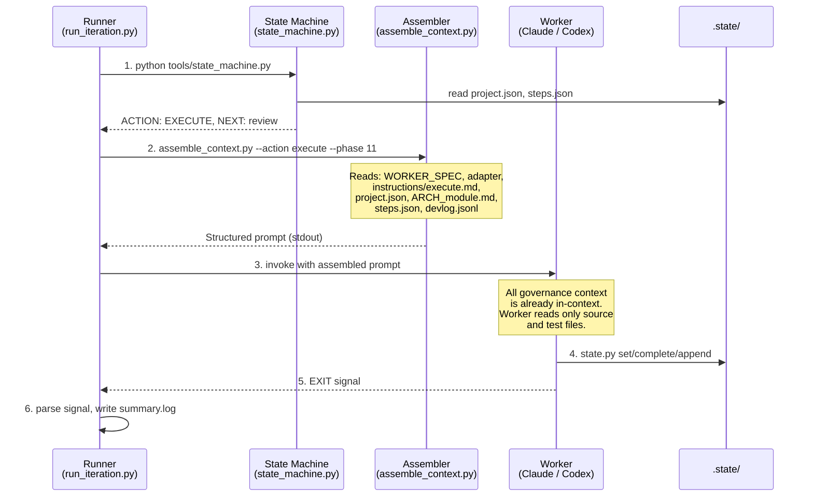
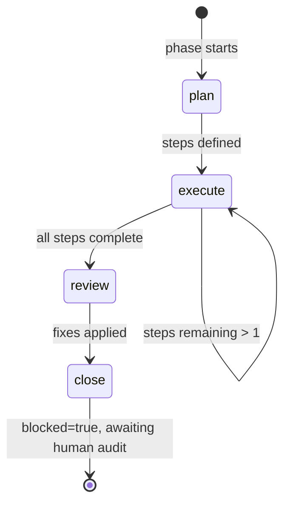
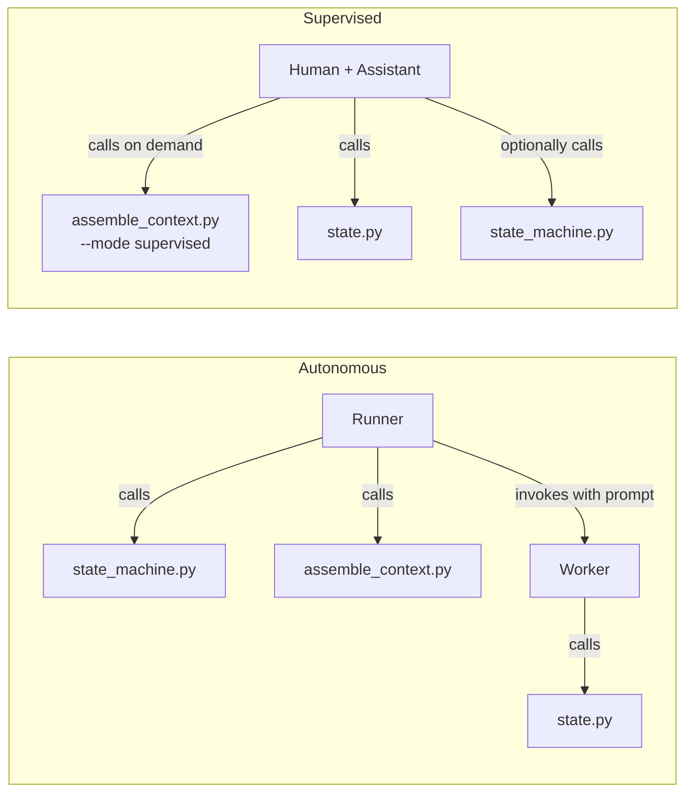

# i2c Workflow Map

## Actor Topology



## Two Dispatch Paths

There are **two independent ways** to dispatch worker iterations:



**Path A (Codexbot):** Deterministic. Codexbot receives a Telegram command, directly shells out to `run_iteration.py`, reads results from files, formats a report. No LLM judgment in the dispatch path — codexbot is a Python app, not an AI session. It also handles `/status`, `/audit`, `/close` by reading `.state/` directly.

**Path B (Orchestrator):** AI-mediated. An orchestrator session (Claude or Codex) receives freeform instructions, decides what to do, shells out to `run_iteration.py`, then reads logs and reports back. The orchestrator makes judgment calls: "should I dispatch another iter?", "is this error worth escalating?", "what do I tell the human?"

**Key insight:** Both paths use the same runner, same worker, same state files. The difference is who sits between the human and the runner: a deterministic bot or an AI session.

---

## Invocation Flow

The key change from e2e: the runner assembles context *before* the worker starts. The worker reads zero governance files.



### Single-step vs multi-step

**Single-step (STEP_BUDGET = 1, common case):** Runner handles everything before invocation. Worker does one action and exits.

**Multi-step (STEP_BUDGET > 1):** First step's context arrives pre-assembled. Between steps, the worker calls the assembler for updated context:

```bash
# Mid-step context request:
python3 tools/assemble_context.py --action execute --phase 11

# Or request a single section:
python3 tools/assemble_context.py --section architecture
python3 tools/assemble_context.py --section module event_store
```

---

## Phase Lifecycle — Step by Step



| State | Assembled into prompt | Worker reads directly | Worker writes |
|-------|----------------------|----------------------|---------------|
| **plan** | instructions/plan.md, PROJECT.md, ARCHITECTURE.md, ARCH_module.md | — | steps.json, project.json, devlog.jsonl |
| **execute** | instructions/execute.md, ARCH_module.md, steps.json, recent devlog | source files, test files | steps.json, devlog.jsonl, project.json |
| **review** | instructions/review.md, ARCH_module.md, ARCHITECTURE.md, phase devlog, decisions | source files | devlog.jsonl, project.json |
| **close** | instructions/close.md, ARCH_module.md, phase devlog, decisions | source/test files | phases.json, project.json (gotchas, blocked) |

**Always assembled** (every action): WORKER_SPEC (identity, loop, escalation, output contract, prohibitions), adapter (tool rules, project notes), project.json (state, gotchas), module list.

---

## Detailed Action Map

### What happens BEFORE the worker starts

```
Dispatch request (human → codexbot/orch → runner)
  │
  ├─ Runner calls: python tools/state_machine.py
  │   ├─ Reads: .state/project.json, .state/steps.json
  │   ├─ Checks: blocked? budget exhausted?
  │   ├─ Computes: ACTION + NEXT
  │   └─ If EXIT → runner stops, no worker invocation
  │
  ├─ Runner calls: python3 tools/assemble_context.py --action $ACTION --phase $PHASE
  │   ├─ Reads: WORKER_SPEC.md (identity, loop, escalation, output, prohibitions)
  │   ├─ Reads: adapter file (tool rules, project notes, module list)
  │   ├─ Reads: instructions/$ACTION.md (action procedure)
  │   ├─ Reads: .state/project.json (state, gotchas)
  │   ├─ Reads: PROJECT.md (if PLAN action)
  │   ├─ Reads: ARCHITECTURE.md (if PLAN or REVIEW action)
  │   ├─ Reads: ARCH_module.md (all actions)
  │   ├─ Reads: .state/steps.json, devlog.jsonl, decisions.json (per action)
  │   └─ Outputs: structured prompt with section delimiters
  │
  └─ Runner invokes worker with assembled prompt
      └─ Worker has zero governance files to read — starts working immediately
```

### PLAN action

| Step | What happens | Worker reads | Worker writes |
|------|-------------|-------------|---------------|
| 1 | Determine scope | (in prompt: PROJECT.md, ARCHITECTURE.md) | — |
| 2 | Identify work regime | (in prompt: instructions/plan.md) | — |
| 3 | Break into steps | (in prompt: ARCH_module.md) | — |
| 4 | **If non-leaf module:** dependency probe | source files for dep verification | devlog.jsonl (probe result) |
| 5 | Write step breakdown | — | steps.json (new step records) |
| 6 | Transition state | — | project.json (state→execute) |
| 7 | Commit + devlog | — | devlog.jsonl, git commit |

### EXECUTE action (repeats per step)

| Step | What happens | Worker reads | Worker writes |
|------|-------------|-------------|---------------|
| 1 | Pick next pending step | (in prompt: steps.json) | — |
| 2 | Read context | source files, test files | — |
| 3 | Implement | source files, test files | source files, test files |
| 4 | Run tests | — | — |
| 5 | Mark step complete | — | steps.json (step→complete) |
| 6 | Log what happened | — | devlog.jsonl (append entry) |
| 7 | Commit | — | git commit |
| 8 | Transition state | — | project.json (state→review if last step) |

### REVIEW action

| Step | What happens | Worker reads | Worker writes |
|------|-------------|-------------|---------------|
| 1 | Identify phase scope | (in prompt: steps.json) | — |
| 2 | Read all phase code | source files | — |
| 3 | Check: dead code, arch drift, simplification | (in prompt: ARCHITECTURE.md) | — |
| 4 | Categorize findings | — | — |
| 5 | Apply must-fix + should-fix | source files | source files |
| 6 | Log review findings | — | devlog.jsonl (review entry) |
| 7 | Commit fixes | — | git commit |
| 8 | Transition state | — | project.json (state→close) |

### CLOSE action

| Step | What happens | Worker reads | Worker writes |
|------|-------------|-------------|---------------|
| 1 | Run phase-level tests | source/test files | — |
| 2 | **If non-leaf module:** integration check | consumer source/test files | devlog.jsonl |
| 3 | DEVLOG learning review | (in prompt: devlog.jsonl) | project.json (gotchas[]) |
| 4 | Contract scan + propagation | (in prompt: devlog.jsonl) | ARCH_*.md (if needed) |
| 5 | Update phase status | — | phases.json (phase→complete) |
| 6 | Set blocked | — | project.json (blocked=true) |
| 7 | Commit | — | git commit |
| 8 | Exit | — | EXIT signal |

### After CLOSE — human gate

| Step | Who | What happens | Reads | Writes |
|------|-----|-------------|-------|--------|
| 1 | Codexbot/Orch | Report phase complete | .state/, logs/ | Telegram message |
| 2 | Human | Audit: review commits, decisions, contracts | git log, decisions.json | — |
| 3 | Human | `/close` command | — | — |
| 4 | Codexbot/Orch | Clear gate | — | project.json (blocked=false, state=plan) |
| 5 | Codexbot/Orch | Append audit record | — | audits.log |
| 6 | Human | `/run N` — next phase begins | — | — |

---

## What Changes from e2e → i2c

### Files that DISAPPEAR

| e2e artifact | Why it's gone | Replaced by |
|-------------|---------------|-------------|
| DEVPLAN.md (per-project) | State is in .state/, scope is in PROJECT.md | .state/project.json + PROJECT.md |
| DEVPLAN frontmatter | Structured state replaces it | .state/project.json |
| Step checklists (`- [x]`) | steps.json has explicit status | .state/steps.json |
| DEVLOG.md | Structured log replaces it | .state/devlog.jsonl |
| DEVLOG_archive.md | JSONL is queryable by phase, no archival needed | — |
| DECISIONS.md | Structured decisions | .state/decisions.json |
| COMMANDS/*.md (7 files) | Consolidated into 4 instruction files | instructions/*.md |
| GOVERNANCE.md (standalone) | Content folded into human orientation docs | — |
| Tiered reading logic in adapter | Assembler decides what to include | assemble_context.py |
| Worker file-discovery turns | Context arrives pre-assembled | — |

### Files that STAY (same purpose)

| e2e artifact | i2c equivalent | Changes |
|-------------|----------------|---------|
| PROJECT.md | PROJECT.md | Unchanged — scope, constraints, success criteria |
| ARCHITECTURE.md | ARCHITECTURE.md | Unchanged — component map, contracts, impl sequence |
| ARCH_*.md | ARCH_*.md | Unchanged — per-module interface specs |
| run-iteration.sh | run_iteration.py | Python rewrite. Calls state_machine + assembler before invoking worker; emits cost/budget halts; invariants check after every CLOSE. |
| state_machine.sh | state_machine.py | Python rewrite. Reads `.state/` JSON via `tools/validate.py` (was: bash + jq). Called by runner, not worker. |
| summary.log | summary.log | Unchanged — runner's per-iteration log |
| parse_jsonl.py etc. | parse_jsonl.py etc. | Unchanged — log parsing tools |

### Files that TRANSFORM

| e2e artifact | i2c equivalent | What changes |
|-------------|----------------|-------------|
| WORKER_SPEC.md | WORKER_SPEC.md | Simplified: no sed/DEVPLAN writes. Included in assembled prompt by runner. |
| CLAUDE_worker.md | CLAUDE.md (template) | Slimmed: tool rules + project notes only. No reading tiers, no command mapping. Included by assembler. |
| CODEX_worker.md | CODEX.md (template) | Same as CLAUDE.md but Codex-specific tool rules. |
| CLAUDE_orch.md | CLAUDE_orch.md (template) | Reads .state/ instead of DEVPLAN. Same role. |
| CODEX_ORCH.md | CODEX_ORCH.md (template) | Reads .state/ instead of DEVPLAN. Same role. |
| — (new) | assemble_context.py | Builds structured prompt from .state/, governance docs, project docs. |

---

## Decisions Log

| # | Question | Decision |
|---|----------|----------|
| D1 | Project name | **i2c** (idea to code) |
| D2 | Migration strategy | **Clean break**, new projects only. No backward compat. |
| D3 | Rendered views | **None persistent**. On-demand only (codexbot commands, render scripts). |
| D4 | Write API | **Python CLI** (`tools/state.py`) — thin, stdlib only. State machine stays bash for reads. |
| D5 | Cold start context | Worker reads **project.json + PROJECT.md**. No DEVPLAN. |
| D6 | Gotchas storage | **`gotchas` array in project.json**. |
| D7 | DEVLOG archival | **No compaction**. Single JSONL file. Revisit if real projects show size issues. |
| D8 | Instruction files | **4 core files** (plan, execute, review, close) with conditional sections for dependency-probe and integration-check. |
| D9 | State machine language | **Bash + jq**. Simplest viable. |
| D10 | Worker spec + adapter structure | **Keep separate**. WORKER_SPEC (loop contract) + adapter (tool rules) + instruction files (action procedures). |
| D11 | GOVERNANCE.md | **No standalone file**. Content folded into instruction files + human orientation docs. |
| D12 | Project location | **Standalone `p:\shared\i2c`**, sibling to e2e. |
| D13 | Codexbot changes | **Deferred** until state format is finalized. StateReader replaces LogReader. |
| D14 | Context assembly | **Full deterministic assembly**. Runner builds prompt via `assemble_context.py`. Worker reads zero governance files. |
| D15 | Prompt structure | **Structured sections** with `═══` delimiters. Model navigates by section headers. |
| D16 | Mid-step context | **Assembler doubles as mid-step provider**. Worker calls `assemble_context.py --section X` for governance context. Source reads stay direct. |
| D17 | Adapter role | **Shrinks to tool rules + project notes**. Included by assembler, not read by worker. |
| D18 | State machine caller | **Runner calls state machine**, not worker. Worker receives ACTION/NEXT in prompt. Multi-step: worker calls between steps. |
| D19 | Governance content format | **Stays markdown**. Assembler includes wholesale; structuring as JSON adds parse overhead without query benefit. Assembler handles conditional section filtering deterministically (extracts by heading, evaluates against .state/, strips what doesn't apply). |
| D20 | Supervised mode | **Same tools, different caller**. Assembler supports `--mode supervised` (strips exit signals, budget, adds approval pauses). state.py works the same. No separate command files — assembler replaces all 5 e2e COMMANDS. |

---

## Supervised Mode

In supervised mode, a human works directly with an AI assistant. The same tools serve both modes:



| e2e command | i2c supervised equivalent |
|------------|--------------------------|
| `cold-start.md` | `assemble_context.py --section status` |
| `phase-plan.md` | `assemble_context.py --action plan --mode supervised` |
| `step-done.md` | `state.py complete` + `state.py append devlog.jsonl` |
| `phase-review.md` | `assemble_context.py --action review --mode supervised` |
| `phase-complete.md` | `assemble_context.py --action close --mode supervised` |
