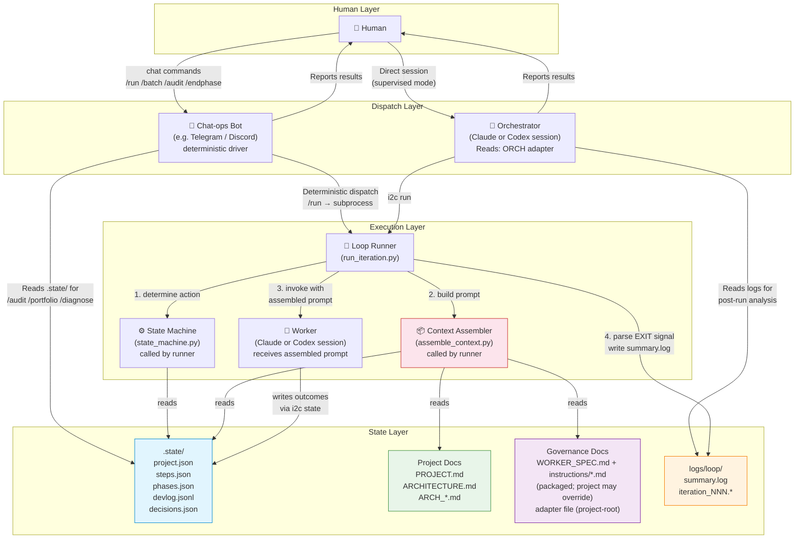
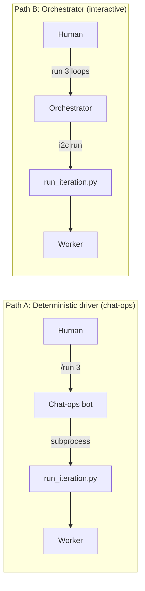
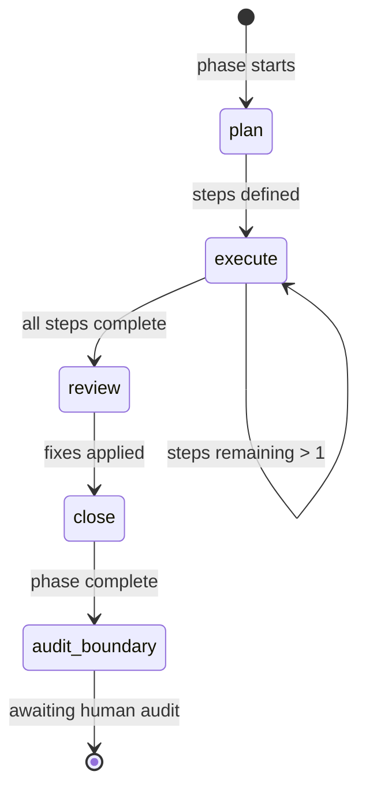
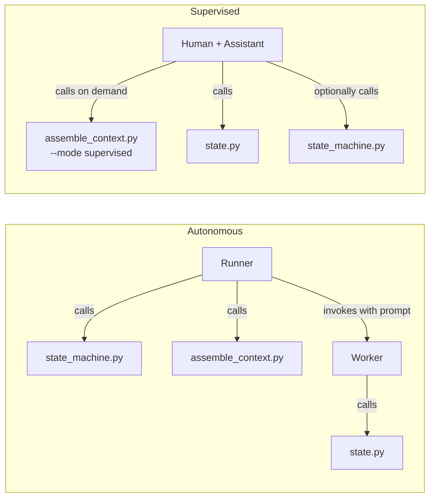

# i2c Workflow Map

## Actor Topology



## Two Dispatch Paths

There are **two independent ways** to dispatch worker iterations:



**Path A (deterministic driver):** A chat-ops bot (e.g. a Telegram or Discord bot) receives a command, directly shells out to `run_iteration.py`, reads results from files, and formats a report. No LLM judgment in the dispatch path — the bot is a plain program, not an AI session. It also handles the read/gate commands (`/audit`, `/portfolio`, `/diagnose`, `/endphase`) by reading `.state/` directly.

**Path B (Orchestrator):** AI-mediated. An orchestrator session (Claude or Codex) receives freeform instructions, decides what to do, shells out to `run_iteration.py`, then reads logs and reports back. The orchestrator makes judgment calls: "should I dispatch another iter?", "is this error worth escalating?", "what do I tell the human?"

**Key insight:** Both paths use the same runner, same worker, same state files. The difference is who sits between the human and the runner: a deterministic program or an AI session.

> **Current model:** [`DESIGN_packaging_v1.md`](DESIGN_packaging_v1.md) §7 is
> authoritative for the driver/surface architecture and generalizes these two
> paths. Both a chat-ops bot and an orchestrator are **drivers over the
> deterministic `i2c.control` command API**; they differ only in who pulls the
> levers — a deterministic Policy, a Human, or an LLM Agent. §7 factors the
> design into three independent axes (transport/surface, worker backend,
> orchestrator), so "Path A vs Path B" is really one axis — the orchestrator —
> varying while the others stay fixed. Read the diagram above as the two common
> configurations, not the full design.

---

## Invocation Flow

The runner assembles context *before* the worker starts, so the worker reads zero governance files.


### Single-step vs multi-step

**Single-step (STEP_BUDGET = 1, common case):** Runner handles everything before invocation. Worker does one action and exits.

**Multi-step (STEP_BUDGET > 1):** First step's context arrives pre-assembled. Between steps, the worker calls the assembler for updated context:

```bash
# Mid-step context request:
i2c assemble --action execute --phase 11

# Or request a single section:
i2c assemble --section architecture
i2c assemble --section module --module event_store
```

---

## Phase Lifecycle — Step by Step



| State | Assembled into prompt | Worker reads directly | Worker writes |
|-------|----------------------|----------------------|---------------|
| **plan** | instructions/plan.md, PROJECT.md, ARCHITECTURE.md, ARCH_module.md | — | steps.json, project.json, devlog.jsonl |
| **execute** | instructions/execute.md, ARCH_module.md, steps.json, recent devlog | source files, test files | steps.json, devlog.jsonl, project.json |
| **review** | instructions/review.md, ARCH_module.md, ARCHITECTURE.md, phase devlog, decisions | source files | devlog.jsonl, project.json |
| **close** | instructions/close.md, ARCH_module.md, phase devlog, decisions | source/test files | phases.json, project.json (gotchas; state→audit_boundary) |

**Always assembled** (every action): WORKER_SPEC (identity, loop, escalation, output contract, prohibitions), adapter (tool rules, project notes), project.json (state, gotchas), module list.

After CLOSE the worker leaves the project in `audit_boundary`; the human (or an autonomous wrapper) clears the gate — see *Detailed Action Map → Boundary clearing* below.

---

## Detailed Action Map

The per-action procedure — what each of PLAN / EXECUTE / REVIEW / CLOSE reads,
does, and writes, step by step — is the **canonical** content of
`instructions/{plan,execute,review,close}.md` (the same text the assembler puts
in the worker's prompt). See those files for the authoritative steps; the
README's "four worker actions" table is the one-line summary. The diagrams
above show how the runner wraps each action and what the assembler reads.

**Boundary clearing (after CLOSE):** the worker leaves the project in
`audit_boundary`; the human (or an autonomous wrapper) clears the gate with
`i2c state set project.json phase=N+1 state=plan` to advance, or
`i2c state set project.json state=done` to terminate. See the README
("Lifecycle states") and `DECISIONS.md` (D-state-*) for the full rules.

---

## Supervised Mode

In supervised mode, a human works directly with an AI assistant. The same tools serve both modes:



Common supervised commands:

| Task | Command |
|------|---------|
| Cold-start orientation | `i2c status` |
| Plan a phase | `i2c assemble --action plan --mode supervised` |
| Mark a step done | `i2c state complete` + `i2c state append devlog.jsonl` |
| Review a phase | `i2c assemble --action review --mode supervised` |
| Close a phase | `i2c assemble --action close --mode supervised` |
